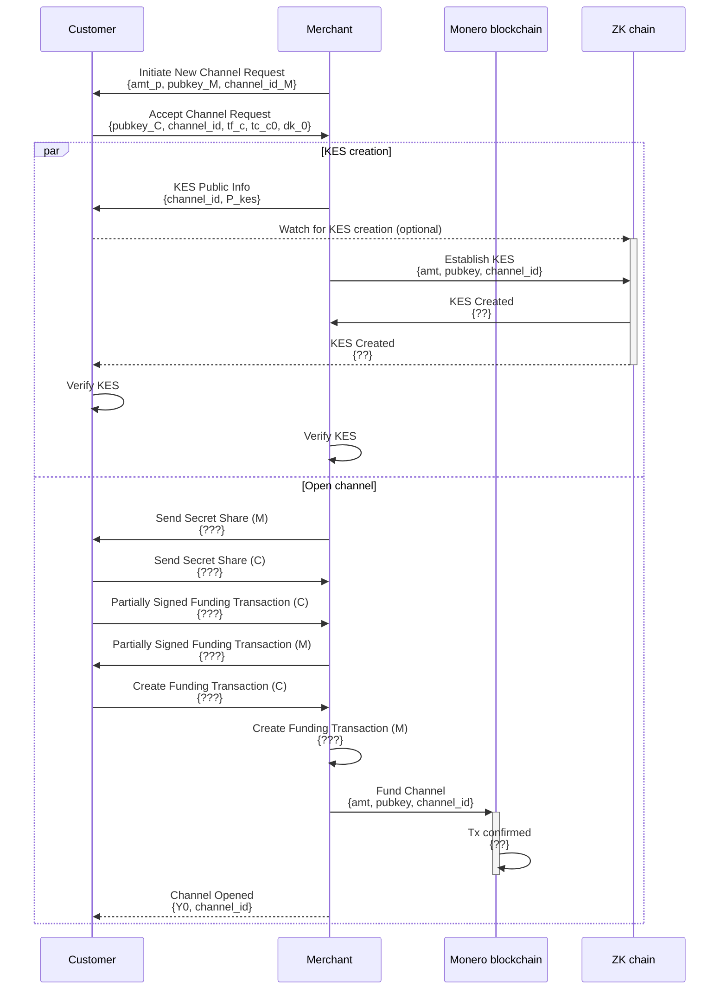

# Channel Establishment

The usual flow is isa follows:

The merchant shares some information with the Customer out-of-band. This could be via a QR code, or a link. This 
information will include the channel ID, the merchant's public key, and the (suggested) amount of Monero to be 
locked in the channel.

Assuming the client is happy with the terms, they will initiate a channel establishment request 
(`InitiateNewChannelRequest`) with the merchant. This request includes 
* the channel ID, 
* the amount of Monero to be locked in the channel (definitive), 
* the customer's public key.
* the encryption key for the key escrow service (KES)

