# Channel Establishment

The usual flow is as follows:

The merchant shares some information with the Customer out-of-band. This could be via a QR code, or a link. This 
information will include the channel ID, the merchant's public key, and the (suggested) amount of Monero to be 
locked in the channel.

Assuming the client is happy with the terms, they will initiate a channel establishment request 
(`InitiateNewChannelRequest`) with the merchant.

Channel establishment involves:
* Setting up a new 2-of-2 multisig Monero wallet, into which the funding transaction funds will be sent.
* Splitting the spending key of the multisig wallet into two secret shares, one for the other party to hold and one 
  that is stored by the key escrow service.
* Creating the key escrow service (KES) on the ZK chain, which will be used to store the one of the secret shares of 
  the 
  multisig wallet. The KES is created by the merchant, and the customer can verify it.
* 
* the channel ID, 
* the amount of Monero to be locked in the channel (definitive), 
* the customer's pseudonymous public key (which the customer can rotate as desired),
* the encryption one-time public key for the key escrow service (KES).
* The split secret for spending the comm

```mermaid
sequenceDiagram
    participant C as Customer
    participant M as Merchant
    participant L1 as Monero blockchain
    participant L2 as ZK chain

    M ->> C: Initiate New Channel Request<br/>{amt_p, pubkey_M, channel_id_M, vk_M, nonce_M}
    C ->> M: Accept Channel Request<br/>{pubkey_C, channel_id, S0_C, vk_C, nonce_C}   //, tf_c, tc_c0, dk_0
    M ->> C: Accept Channel Request<br/>{S0_M}
    par KES creation
        M ->> L2: Reserve KES<br/>{amt_l2}
        L2 ->> M: KES Reserved<br/>{instance_kes, P_kes[]}
        M ->> C: Send Secret Share & KES Public Info (M)<br/>{vssproof_M, vss_enc_M[], instance_kes, P_kes[]}
        C ->> M: Send Secret Share (C)<br/>{vssproof_C, vss_enc_C[]}
        C -->>+ L2: Watch for KES creation (optional)
        M ->> L2: Establish KES<br/>{instance_kes, amt_l2, timer_kes, channel_id, pubkey_M, pubkey_C, vss_enc_M[], vss_enc_C[]}
        L2 ->> M: KES Created<br/>{}
        L2 -->>- C: KES Created<br/>{}
        C ->> C: Verify KES
        M ->> M: Verify KES
    and Open channel
        C ->> M: Partially Signed Funding Transaction (C)<br/>{R_C ... z0_C}
        M ->> C: Partially Signed Funding Transaction (M)<br/>{R_M ... z0_M}
        C ->> M: Create Funding Transaction (C)<br/>{σ_vk_C}
        M ->> M: Create Funding Transaction (M)<br/>{T_x_f}
        M ->>+ L1: Fund Channel<br/>{amt, pubkey, channel_id}
        L1 ->>- L1: Tx confirmed<br/>{}
        M -->> C: Channel Opened<br/>{}
    end
    
    

```

