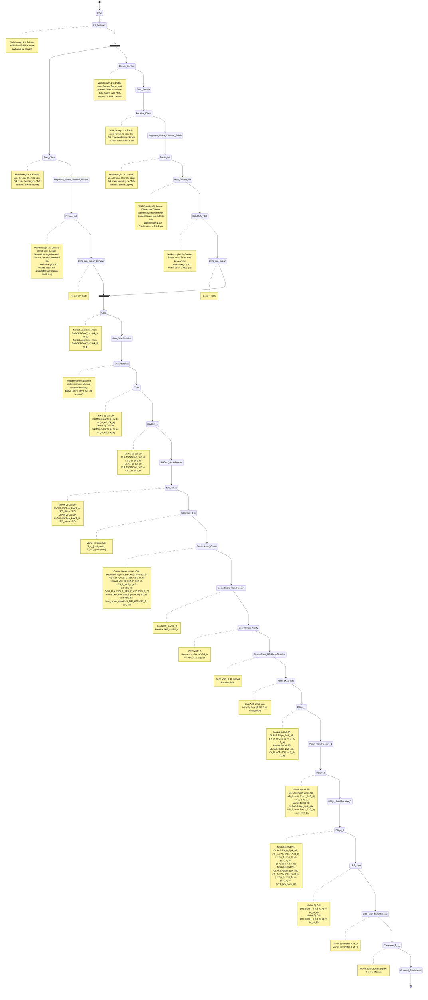

```mermaid
stateDiagram-v2
[*] --> Boot
Boot --> Init_Network
note right of Init_Network
	Walkthrough 1.1: Private walk's into Public's store and asks for service
end note
state fork_state_1 <<fork>>
Init_Network --> fork_state_1
fork_state_1 --> Post_Client
note right of Post_Client
	Walkthrough 1.4: Private uses Grease Client to scan QR code, deciding on "Tab amount" and accepting
end note
Post_Client --> Negotiate_Noise_Channel_Private
Negotiate_Noise_Channel_Private --> Private_Init
note right of Private_Init
	Walkthrough 1.5: Grease Client uses Grease Network to negotiate with Grease Server to establish tab
	Walkthrough 1.5.1: Private uses: *X* in refundable lock (minus XMR fee)
end note
Private_Init --> KES_Info_Public_Receive
note right of KES_Info_Public_Receive
    Receive P_KES
end note
fork_state_1 --> Create_Service
note right of Create_Service
	Walkthrough 1.2: Public uses Grease Server and presses "New Customer Tab" button, with "Tab amount: 1 XMR" default
end note
Create_Service --> Post_Service
Post_Service --> Receive_Client
note right of Receive_Client
	Walkthrough 1.3: Public asks Private to scan the QR code on Grease Server screen to establish a tab
end note
Receive_Client --> Negotiate_Noise_Channel_Public
Negotiate_Noise_Channel_Public --> Public_Init
note right of Public_Init
	Walkthrough 1.4: Private uses Grease Client to scan QR code, deciding on "Tab amount" and accepting
end note
Public_Init --> Wait_Private_Init
note right of Wait_Private_Init
	Walkthrough 1.5: Grease Client uses Grease Network to negotiate with Grease Server to establish tab
	Walkthrough 1.5.2: Public uses: *Y* ZKL2 gas
end note
Wait_Private_Init --> Establish_KES
note right of Establish_KES
	Walkthrough 1.6: Grease Server use KES to start key escrow
	Walkthrough 1.6.1: Public uses: *Z* KES gas
end note
Establish_KES --> KES_Info_Public
note right of KES_Info_Public
    Send P_KES
end note
state join_state_1 <<join>>
KES_Info_Public_Receive --> join_state_1
KES_Info_Public --> join_state_1
join_state_1 --> Gen
note right of Gen
    MoNet Algorithm 1 Gen: Call CAS.Gen(λ) => (sk_A, vk_A)
    MoNet Algorithm 1 Gen: Call CAS.Gen(λ) => (sk_B, vk_B)
end note
Gen --> Gen_SendReceive
Gen_SendReceive --> VerifyBalance
note right of VerifyBalance
    Request current balance statement from Monero node on view key: bal(vk_A) >= bal^0_A (`Tab amount`)
end note
VerifyBalance --> JGen
note right of JGen
    MoNet 1) Call 2P-CLRAS.JGen(vk_A, vk_B) => (vk_AB, s˜k_A)
    MoNet 1) Call 2P-CLRAS.JGen(vk_B, vk_A) => (vk_AB, s˜k_B)
end note
JGen --> SWGen_1
note right of SWGen_1
    MoNet 2) Call 2P-CLRAS.SWGen_1(λ) => (S^0_A, w^0_A)
    MoNet 2) Call 2P-CLRAS.SWGen_1(λ) => (S^0_B, w^0_B)
end note
SWGen_1 --> SWGen_SendReceive
SWGen_SendReceive --> SWGen_2
note right of SWGen_2
    MoNet 2) Call 2P-CLRAS.SWGen_2(w^0_A, S^0_B) => (S^0)
    MoNet 2) Call 2P-CLRAS.SWGen_2(w^0_B, S^0_A) => (S^0)
end note
SWGen_2 --> Generate_T_x
note right of Generate_T_x
    MoNet 3) Generate T_x_f[unsigned] , T_x^0_c[unsigned]
end note
Generate_T_x --> SecretShare_Create
note right of SecretShare_Create
    Create secret shares: Call FeldmanVSS(w^0_B,P_KES) => VSS_B=(VSS_B_A,VSS_B_KES,VSS_B_C) 
    Encrypt VSS_B_KES,P_KES => VSS_B_KES_P_KES
    Set VSS_B=(VSS_B_A,VSS_B_KES_P_KES,VSS_B_C)
    Prove ZKP_B of w^0_B producing S^0_B and VSS_B : Noir_prove_share(S^0_B,P_KES,VSS_B | w^0_B)
end note
SecretShare_Create --> SecretShare_SendReceive
note right of SecretShare_SendReceive
    Send ZKP_B,VSS_B
    Receive ZKP_A,VSS_A
end note
SecretShare_SendReceive --> SecretShare_Verify
note right of SecretShare_Verify
    Verify ZKP_A
    Sign secret shares VSS_A => VSS_A_B_signed
end note
SecretShare_Verify --> SecretShare_KESSendReceive
note right of SecretShare_KESSendReceive
    Send VSS_A_B_signed
    Receive ACK
end note
SecretShare_KESSendReceive --> Auth_ZKL2_gas
note right of Auth_ZKL2_gas
    Give/Auth ZKL2 gas (directly through ZKL2 or through AA)
end note
Auth_ZKL2_gas --> PSign_1
note right of PSign_1
    MoNet 4) Call 2P-CLRAS.PSign_1(vk_AB, s˜k_A, m^0, S^0) => (r_A, R_A)
    MoNet 4) Call 2P-CLRAS.PSign_1(vk_AB, s˜k_B, m^0, S^0) => (r_B, R_B)
end note
PSign_1 --> PSign_SendReceive_1
PSign_SendReceive_1 --> PSign_2
note right of PSign_2
    MoNet 4) Call 2P-CLRAS.PSign_2(vk_AB, s˜k_A, m^0, S^0, r_A, R_B) => (c, z˜^0_A)
    MoNet 4) Call 2P-CLRAS.PSign_2(vk_AB, s˜k_B, m^0, S^0, r_B, R_A) => (c, z˜^0_B)
end note
PSign_2 --> PSign_SendReceive_2
PSign_SendReceive_2 --> PSign_3
note right of PSign_3
    MoNet 4) Call 2P-CLRAS.PSign_3(vk_AB, s˜k_A, m^0, S^0, r_A, R_B, c, z˜^0_A, z˜^0_B) => (z˜^0, c) == (σ˜^0_[s˜k_A,s˜k_B])
    MoNet 4) Call 2P-CLRAS.PSign_3(vk_AB, s˜k_B, m^0, S^0, r_B, R_A, c, z˜^0_B, z˜^0_A) => (z˜^0, c) == (σ˜^0_[s˜k_A,s˜k_B])
end note
PSign_3 --> LRS_Sign
note right of LRS_Sign
    MoNet 5) Call LRS.Sign(T_x_f, s_k_A) => (σ_vk_A)
    MoNet 7) Call LRS.Sign(T_x_f, s_k_B) => (σ_vk_B)
end note
LRS_Sign --> LRS_Sign_SendReceive
note right of LRS_Sign_SendReceive
    MoNet 6) transfer σ_vk_A
    MoNet 8) transfer σ_vk_B
end note
LRS_Sign_SendReceive --> Complete_T_x_f
note right of Complete_T_x_f
    MoNet 9) Broadcast signed T_x_f to Monero
end note
Complete_T_x_f --> Channel_Established
Channel_Established --> [*]
```