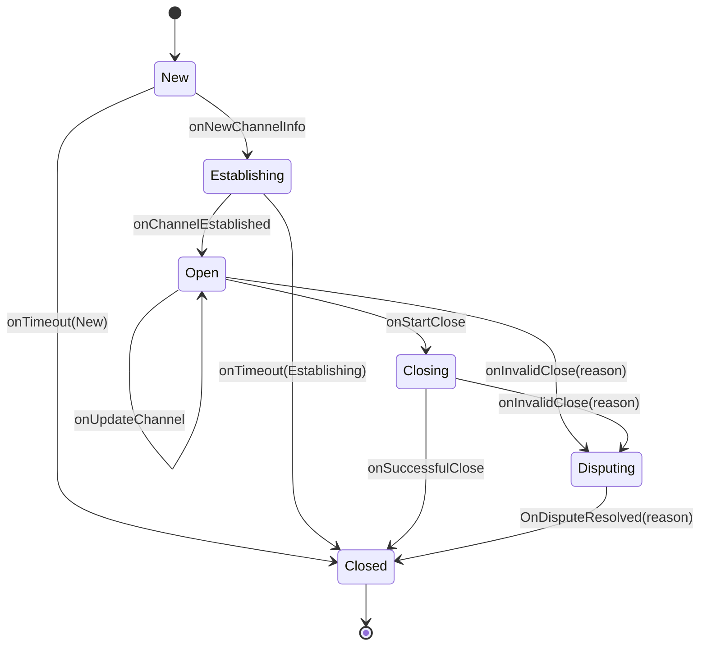

# High level state network

On a high level, the payment channel lifecycle goes through 6 phases:

* `New` - The channel has just been created and is entering the establishment negotiation phase.
  Basic info is swapped in this phase, including the public keys of the peers and the initial balance. The channel 
  ID is derived from the public keys of the peers and the initial balance, plus some salt. An `AckNewChannel` 
  message is sent between the peers to acknowledge the channel creation. Once acknowledged, an `OnNewChannelInfo` 
  event is emitted, and the channel will move to the `Establishing` state. Otherwise, the state will time out and 
  move to the `Closed` state via an `onTimeout` event.
* `Establishing` - The channel is being established. This phase includes the KES establishment and funding 
  transaction. Once the KES is established and both parties have verified the funding transaction, the parties will 
  share an `AckChannelEstablished` message. Once acknowledged, an `OnChannelEstablished` event is emitted, and 
  the channel will move to the `Open` state.
* `Open` - The channel is open and ready for use. Any number of channel update events can occur in this phase and 
  the channel can remain in this state indefinitely. The channel remains in this state until the channel is closed 
  via the amicable `Closing` state or the `Disputing` state. The peers share an `AckWantToClose` message to signal 
  a desire to close the channel. This triggers an `OnStartClose` event, and the channel will move to the `Closing` 
  state. However, if a party tries to maliciously close the channel via the KES using an outdated state, the 
  internal state machine will receive an `InvalidCloseAttempt` interrupt. An `onInvalidClose` event is emitted, and 
  the channel will move to the `Disputing` state.
* `Closing` - The channel is being closed. This phase includes the KES closing and signing of the final commitment 
  transaction. The merchant is responsible for closing down the KES. Once both parties have signed the final 
  commitment transaction, any party will be able to broadcast it, but by convention it will be the merchant that 
  does so. If all communications have resolved amicably, the peers will share an `AckChannelClosed` message. This 
  triggers an `OnSuccessfulClose` event, and the channel will move to the `Closed` state. Otherwise, an 
  `onInvalidClose(reason)` event is emitted, and the channel will move to the `Disputing` state.
* `Closed` - The channel is closed and the funds are being settled. This phase includes the KES closing and 
  broadcast of the commitment transaction.
* `Disputing` - The channel is being disputed. This phase includes invoking the KES to arbitrate the dispute.

Each state contains an internal state machine that describes the events that can occur in that state, including 
handling of all p2p and blockchain network communications. 