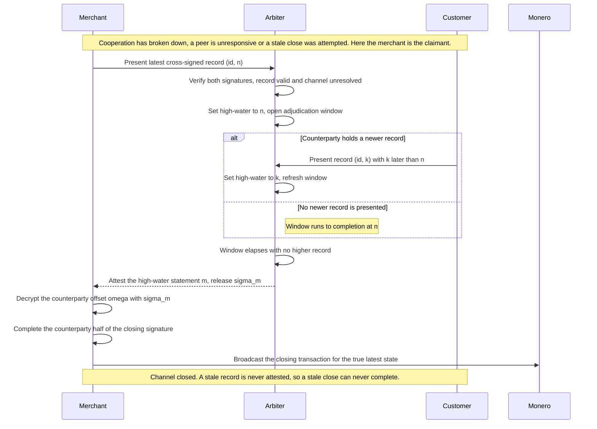

```mermaid
sequenceDiagram
    participant M as Merchant
    participant A as Arbiter
    participant C as Customer
    participant L1 as Monero
    note over M,C: Cooperation has broken down, a peer is unresponsive or a stale close was attempted. Here the merchant is the claimant.
    M->>A: Present latest cross-signed record (id, n)
    A->>A: Verify both signatures, record valid and channel unresolved
    A->>A: Set high-water to n, open adjudication window
    alt Counterparty holds a newer record
        C->>A: Present record (id, k) with k later than n
        A->>A: Set high-water to k, refresh window
    else No newer record is presented
        note right of A: Window runs to completion at n
    end
    A->>A: Window elapses with no higher record
    A-->>M: Attest the high-water statement m, release sigma_m
    M->>M: Decrypt the counterparty offset omega with sigma_m
    M->>M: Complete the counterparty half of the closing signature
    M->>L1: Broadcast the closing transaction for the true latest state
    note over M,C: Channel closed. A stale record is never attested, so a stale close can never complete.
```
