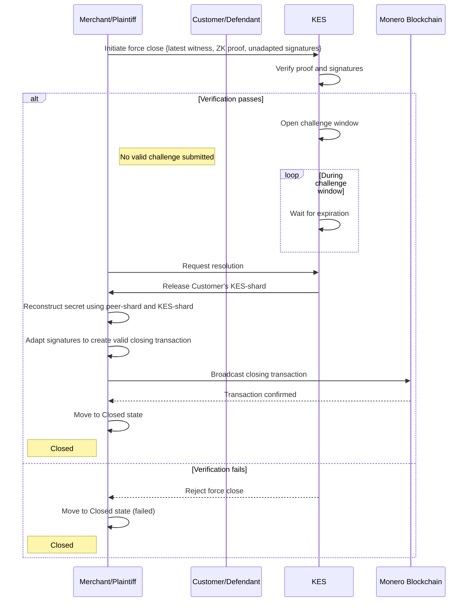

```mermaid
sequenceDiagram
    participant Merchant as Merchant/Plaintiff
    participant Customer as Customer/Defendant
    participant KES
    participant Monero as Monero Blockchain
    Merchant->>KES: Initiate force close {latest witness, ZK proof, unadapted signatures}
    KES->>KES: Verify proof and signatures
    alt Verification passes
        KES->>KES: Open challenge window
        note left of Customer: No valid challenge submitted
        loop During challenge window
            KES->>KES: Wait for expiration
        end
        Merchant->>KES: Request resolution
        KES->>Merchant: Release Customer's KES-shard
        Merchant->>Merchant: Reconstruct secret using peer-shard and KES-shard
        Merchant->>Merchant: Adapt signatures to create valid closing transaction
        Merchant->>Monero: Broadcast closing transaction
        Monero-->>Merchant: Transaction confirmed
        Merchant->>Merchant: Move to Closed state
        note left of Merchant: Closed
    else Verification fails	
        KES-->>Merchant: Reject force close
        Merchant->>Merchant: Move to Closed state (failed)
        note left of Merchant: Closed
    end
```