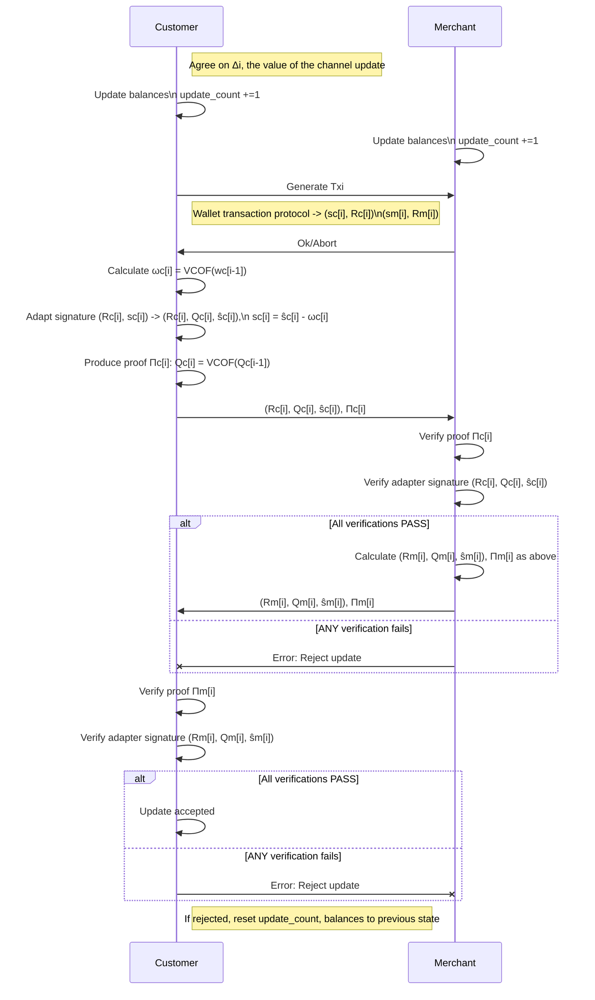

```mermaid
sequenceDiagram
    participant C as Customer
    participant M as Merchant

    note right of C: Agree on Δi, the value of the channel update
    C->>C: Update balances\n update_count +=1
    M->>M: Update balances\n update_count +=1
    
    C->>M: Generate Txi
    note right of C: Wallet transaction protocol -> (sc[i], Rc[i])\n(sm[i], Rm[i])
    M->>C: Ok/Abort    

    C->>C: Calculate ωc[i] = VCOF(wc[i-1])
    C->>C: Adapt signature (Rc[i], sc[i]) -> (Rc[i], Qc[i], ŝc[i]),\n sc[i] = ŝc[i] - ωc[i]
    C->>C: Produce proof Πc[i]: Qc[i] = VCOF(Qc[i-1])
    
    C->>M: (Rc[i], Qc[i], ŝc[i]), Πc[i]
    
    M->>M: Verify proof Πc[i]
    M->>M: Verify adapter signature (Rc[i], Qc[i], ŝc[i])
    alt All verifications PASS
        M->>M: Calculate (Rm[i], Qm[i], ŝm[i]), Πm[i] as above
        M->>C: (Rm[i], Qm[i], ŝm[i]), Πm[i]
    else ANY verification fails 
        M-xC: Error: Reject update
    end
    
    C->>C: Verify proof Πm[i]
    C->>C: Verify adapter signature (Rm[i], Qm[i], ŝm[i])
    alt All verifications PASS
        C->>C: Update accepted
    else ANY verification fails 
        C-xM: Error: Reject update
    end
    
    note right of C: If rejected, reset update_count, balances to previous state

```