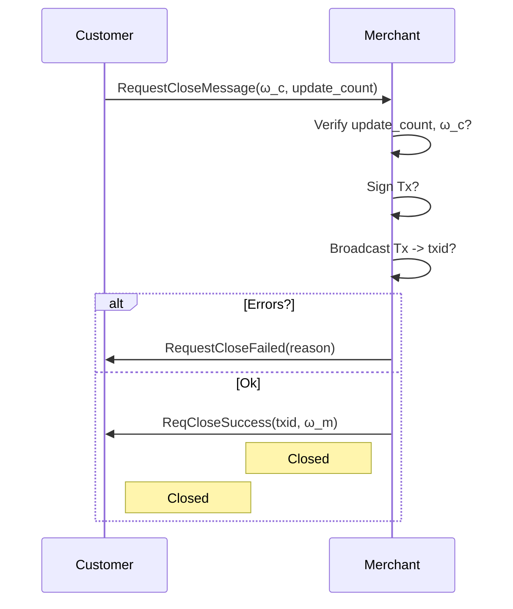

```mermaid
sequenceDiagram
  participant C as Customer
  participant M as Merchant

C->>M: RequestCloseMessage(ω_c, update_count)
M->>M: Verify update_count, ω_c?
M->>M: Sign Tx?
M->>M: Broadcast Tx -> txid?
alt Errors?
  M->>C: RequestCloseFailed(reason)
else Ok
  M->>C: ReqCloseSuccess(txid, ω_m)
  note left of M: Closed
  note right of C: Closed
end
```
