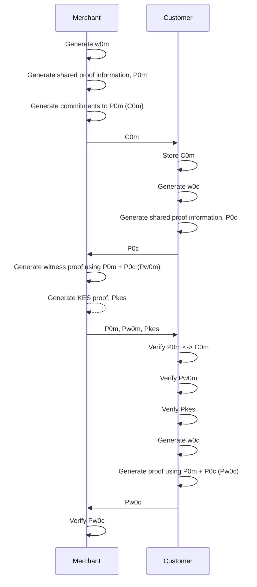

```mermaid
sequenceDiagram
participant M as Merchant
participant C as Customer

M->>M: Generate w0m
M->>M: Generate shared proof information, P0m
M->>M: Generate commitments to P0m (C0m)
M->>C: C0m
C->>C: Store C0m
C->>C: Generate w0c
C->>C: Generate shared proof information, P0c
C->>M: P0c
M->>M: Generate witness proof using P0m + P0c (Pw0m)
M-->>M: Generate KES proof, Pkes
M->>C: P0m, Pw0m, Pkes
C->>C: Verify P0m <-> C0m
C->>C: Verify Pw0m
C->>C: Verify Pkes
C->>C: Generate w0c
C->>C: Generate proof using P0m + P0c (Pw0c)
C->>M: Pw0c
M->>M: Verify Pw0c
```