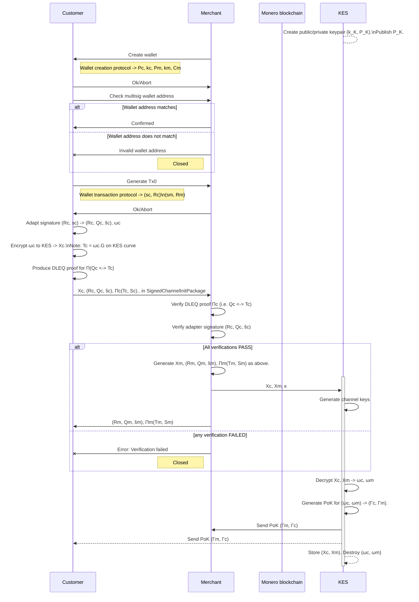
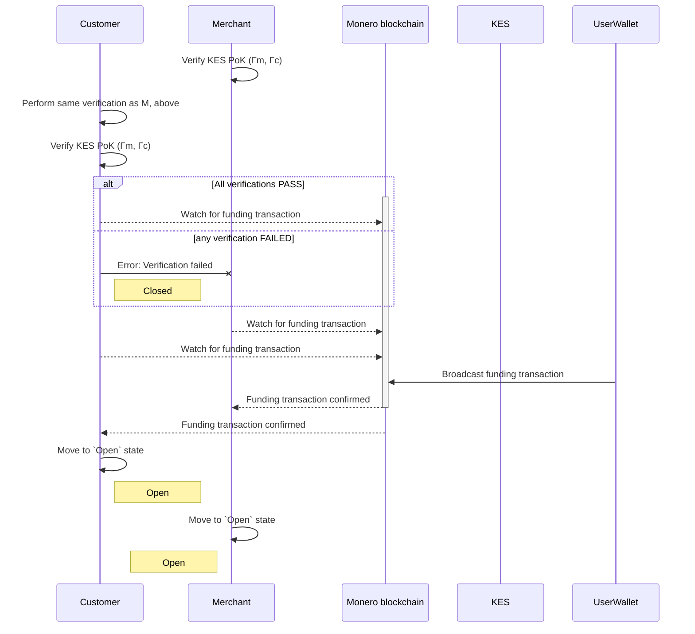

```mermaid
sequenceDiagram
    participant C as Customer
    participant M as Merchant
    participant L1 as Monero blockchain
    participant KES as KES

    KES-->KES: Create public/private keypair (k_K, P_K).\nPublish P_K.
    M->>C: Create wallet
    note right of C: Wallet creation protocol -> Pc, kc, Pm, km, Cm
    C->>M: Ok/Abort

    C->>M: Check multisig wallet address
    alt Wallet address matches
        M->>C: Confirmed
    else Wallet address does not match
        M-xC: Invalid wallet address
        note left of M: Closed
    end

    C->>M: Generate Tx0
    note right of C: Wallet transaction protocol -> (sc, Rc)\n(sm, Rm)
    M->>C: Ok/Abort
    
    C->>C: Adapt signature (Rc, sc) -> (Rc, Qc, ŝc), ωc
    C->>C: Encrypt ωc to KES -> Xc.\nNote: Tc = ωc.G on KES curve
    C->>C: Produce DLEQ proof for Π(Qc <-> Tc) 
    C->>M: Χc, (Rc, Qc, ŝc), Πc(Tc, Sc).. in SignedChannelInitPackage
    
    M->>M: Verify DLEQ proof Πc (i.e. Qc <-> Tc)
    M->>M: Verify adapter signature (Rc, Qc, ŝc)
    alt All verifications PASS
        M->>M: Generate Χm, (Rm, Qm, ŝm), Πm(Tm, Sm) as above.
        activate KES
        M->>KES: Xc, Xm, κ
        KES->>KES: Generate channel keys
        M->>C: (Rm, Qm, ŝm), Πm(Tm, Sm)
    else any verification FAILED
        M-xC: Error: Verification failed
        note left of M: Closed
    end
    
    KES->>KES: Decrypt Xc, Xm -> ωc, ωm
    KES->>KES: Generate PoK for (ωc, ωm) -> (Γc, Γm).
    KES->>M: Send PoK (Γm, Γc)
    KES-->>C: Send PoK (Γm, Γc)
    KES-->>KES: Store (Xc, Xm). Destroy (ωc, ωm)
    deactivate KES
```

```mermaid
sequenceDiagram
    participant C as Customer
    participant M as Merchant
    participant L1 as Monero blockchain
    participant KES as KES
    
    M->>M: Verify KES PoK (Γm, Γc)
    C->>C: Perform same verification as M, above
    C->>C: Verify KES PoK (Γm, Γc)
    
    alt All verifications PASS
        activate L1
        C-->>L1: Watch for funding transaction
    else any verification FAILED
        C-xM: Error: Verification failed
        note right of C: Closed
    end

    M-->>L1: Watch for funding transaction
    C-->>L1: Watch for funding transaction
   
    
    UserWallet->>L1: Broadcast funding transaction
    L1-->>M: Funding transaction confirmed
    deactivate L1
    L1-->>C: Funding transaction confirmed
    C->>C: Move to `Open` state
    note right of C: Open
    M->>M: Move to `Open` state
    note left of M: Open
```