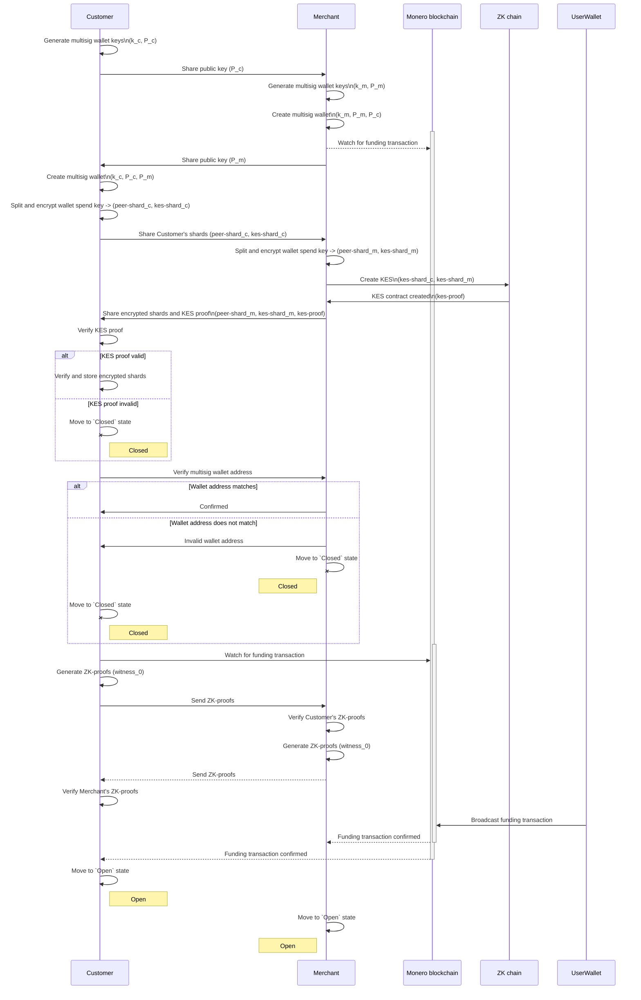

```mermaid
sequenceDiagram
    participant C as Customer
    participant M as Merchant
    participant L1 as Monero blockchain
    participant L2 as ZK chain

 
    C->>C: Generate multisig wallet keys\n(k_c, P_c)
    C->>M: Share public key (P_c)
    M->>M: Generate multisig wallet keys\n(k_m, P_m)
    M->>M: Create multisig wallet\n(k_m, P_m, P_c)
    activate L1
    M-->>L1: Watch for funding transaction
    M->>C: Share public key (P_m)
    C->>C: Create multisig wallet\n(k_c, P_c, P_m)
    C->>C: Split and encrypt wallet spend key -> (peer-shard_c, kes-shard_c)
    C->>M: Share Customer's shards (peer-shard_c, kes-shard_c)
    M->>M: Split and encrypt wallet spend key -> (peer-shard_m, kes-shard_m)
    M->>L2: Create KES\n(kes-shard_c, kes-shard_m)
    L2->>M: KES contract created\n(kes-proof)
    M->>C: Share encrypted shards and KES proof\n(peer-shard_m, kes-shard_m, kes-proof)
    C->>C: Verify KES proof
    alt KES proof valid
        C->>C: Verify and store encrypted shards
    else KES proof invalid
        C-xC: Move to `Closed` state
        note right of C: Closed
    end
    C->>M: Verify multisig wallet address
    alt Wallet address matches
        M->>C: Confirmed
    else Wallet address does not match
        M->>C: Invalid wallet address
        M-xM: Move to `Closed` state
        note left of M: Closed
        C-xC: Move to `Closed` state
        note right of C: Closed
    end
    activate L1
    C->>L1: Watch for funding transaction

    C->>C: Generate ZK-proofs (witness_0)
    C->>M: Send ZK-proofs
    M->>M: Verify Customer's ZK-proofs
    M->>M: Generate ZK-proofs (witness_0)
    M-->>C: Send ZK-proofs
    C->>C: Verify Merchant's ZK-proofs
    
    
    UserWallet->>L1: Broadcast funding transaction
    L1-->>M: Funding transaction confirmed
    deactivate L1
    L1-->>C: Funding transaction confirmed
    deactivate L1
    C->>C: Move to `Open` state
    note right of C: Open
    M->>M: Move to `Open` state
    note left of M: Open
    
    
```