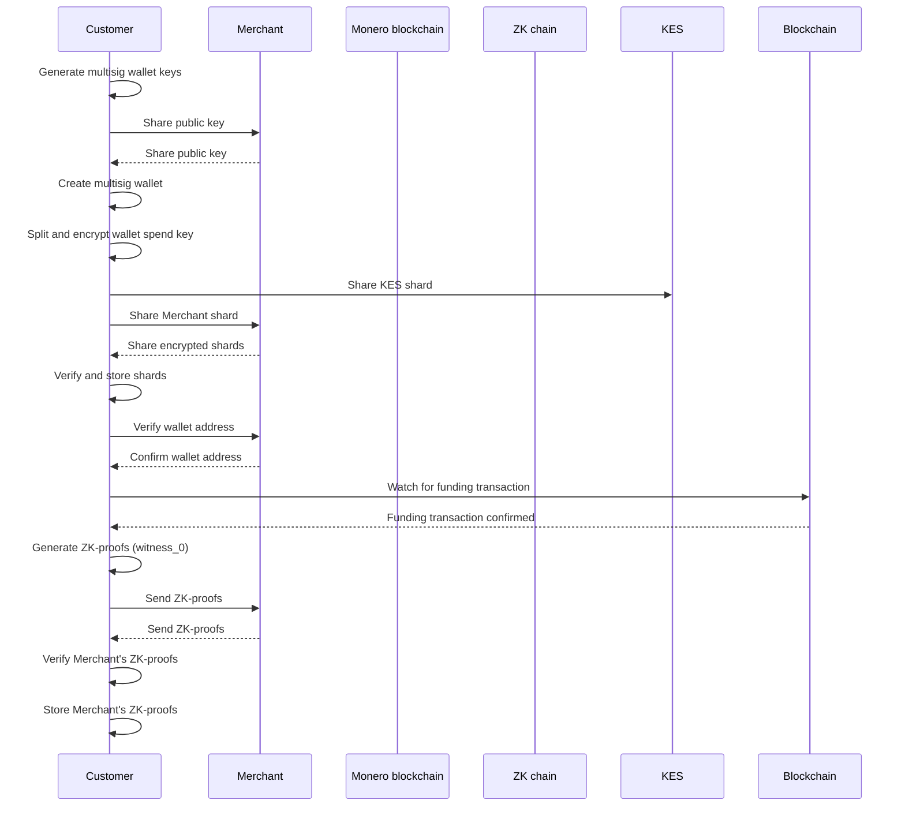

```mermaid
sequenceDiagram
    participant C as Customer
    participant M as Merchant
    participant L1 as Monero blockchain
    participant L2 as ZK chain

 
    C->>C: Generate multisig wallet keys
    C->>M: Share public key
    M-->>C: Share public key
    C->>C: Create multisig wallet

    C->>C: Split and encrypt wallet spend key
    C->>KES: Share KES shard
    C->>M: Share Merchant shard
    M-->>C: Share encrypted shards
    C->>C: Verify and store shards

    C->>M: Verify wallet address
    M-->>C: Confirm wallet address

    C->>Blockchain: Watch for funding transaction
    Blockchain-->>C: Funding transaction confirmed

    C->>C: Generate ZK-proofs (witness_0)
    C->>M: Send ZK-proofs
    M-->>C: Send ZK-proofs
    C->>C: Verify Merchant's ZK-proofs
    C->>C: Store Merchant's ZK-proofs
```