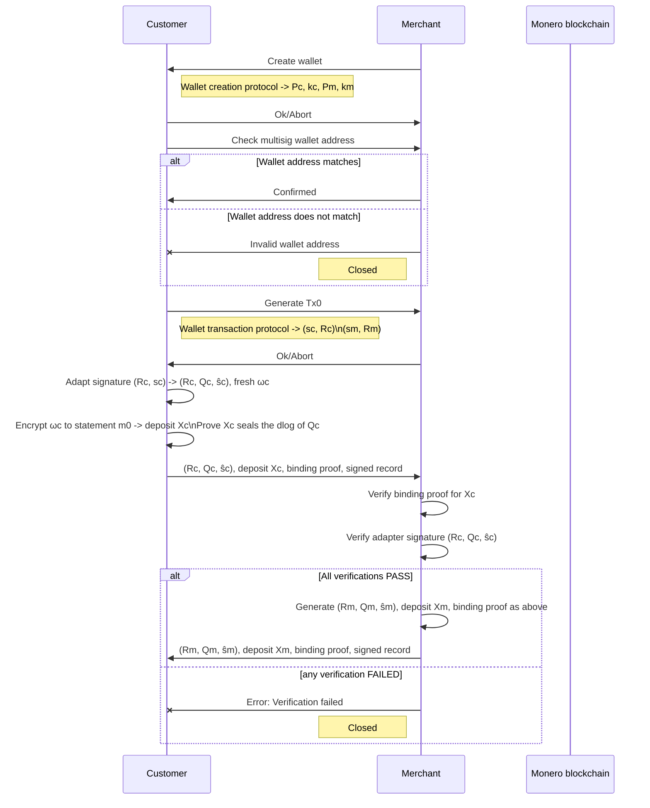

```mermaid
sequenceDiagram
    participant C as Customer
    participant M as Merchant
    participant L1 as Monero blockchain

    M->>C: Create wallet
    note right of C: Wallet creation protocol -> Pc, kc, Pm, km
    C->>M: Ok/Abort

    C->>M: Check multisig wallet address
    alt Wallet address matches
        M->>C: Confirmed
    else Wallet address does not match
        M-xC: Invalid wallet address
        note left of M: Closed
    end

    C->>M: Generate Tx0
    note right of C: Wallet transaction protocol -> (sc, Rc)\n(sm, Rm)
    M->>C: Ok/Abort

    C->>C: Adapt signature (Rc, sc) -> (Rc, Qc, ŝc), fresh ωc
    C->>C: Encrypt ωc to statement m0 -> deposit Xc\nProve Xc seals the dlog of Qc
    C->>M: (Rc, Qc, ŝc), deposit Xc, binding proof, signed record

    M->>M: Verify binding proof for Xc
    M->>M: Verify adapter signature (Rc, Qc, ŝc)
    alt All verifications PASS
        M->>M: Generate (Rm, Qm, ŝm), deposit Xm, binding proof as above
        M->>C: (Rm, Qm, ŝm), deposit Xm, binding proof, signed record
    else any verification FAILED
        M-xC: Error: Verification failed
        note left of M: Closed
    end
```
