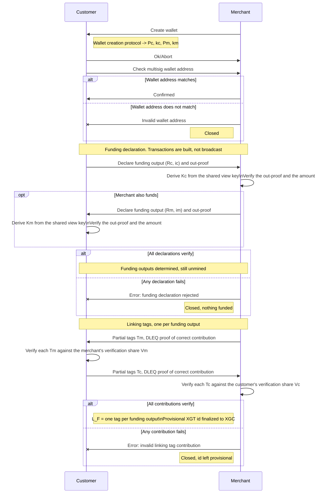

```mermaid
sequenceDiagram
    participant C as Customer
    participant M as Merchant

    M->>C: Create wallet
    note right of C: Wallet creation protocol -> Pc, kc, Pm, km
    C->>M: Ok/Abort

    C->>M: Check multisig wallet address
    alt Wallet address matches
        M->>C: Confirmed
    else Wallet address does not match
        M-xC: Invalid wallet address
        note left of M: Closed
    end

    note over C,M: Funding declaration. Transactions are built, not broadcast

    C->>M: Declare funding output (Rc, ic) and out-proof
    M->>M: Derive Kc from the shared view key\nVerify the out-proof and the amount
    opt Merchant also funds
        M->>C: Declare funding output (Rm, im) and out-proof
        C->>C: Derive Km from the shared view key\nVerify the out-proof and the amount
    end
    alt All declarations verify
        note over C,M: Funding outputs determined, still unmined
    else Any declaration fails
        M-xC: Error: funding declaration rejected
        note left of M: Closed, nothing funded
    end

    note over C,M: Linking tags, one per funding output

    M->>C: Partial tags Tm, DLEQ proof of correct contribution
    C->>C: Verify each Tm against the merchant's verification share Vm
    C->>M: Partial tags Tc, DLEQ proof of correct contribution
    M->>M: Verify each Tc against the customer's verification share Vc
    alt All contributions verify
        note right of C: L_F = one tag per funding output\nProvisional XGT id finalized to XGC
    else Any contribution fails
        M-xC: Error: invalid linking tag contribution
        note left of M: Closed, id left provisional
    end
```
