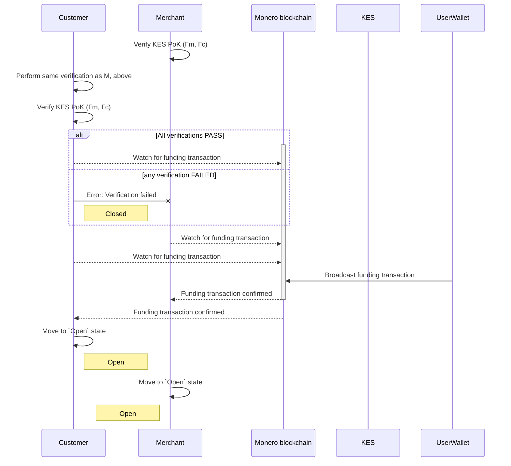

```mermaid
sequenceDiagram
    participant C as Customer
    participant M as Merchant
    participant L1 as Monero blockchain
    participant KES as KES
    
    M->>M: Verify KES PoK (Γm, Γc)
    C->>C: Perform same verification as M, above
    C->>C: Verify KES PoK (Γm, Γc)
    
    alt All verifications PASS
        activate L1
        C-->>L1: Watch for funding transaction
    else any verification FAILED
        C-xM: Error: Verification failed
        note right of C: Closed
    end

    M-->>L1: Watch for funding transaction
    C-->>L1: Watch for funding transaction
   
    
    UserWallet->>L1: Broadcast funding transaction
    L1-->>M: Funding transaction confirmed
    deactivate L1
    L1-->>C: Funding transaction confirmed
    C->>C: Move to `Open` state
    note right of C: Open
    M->>M: Move to `Open` state
    note left of M: Open
```