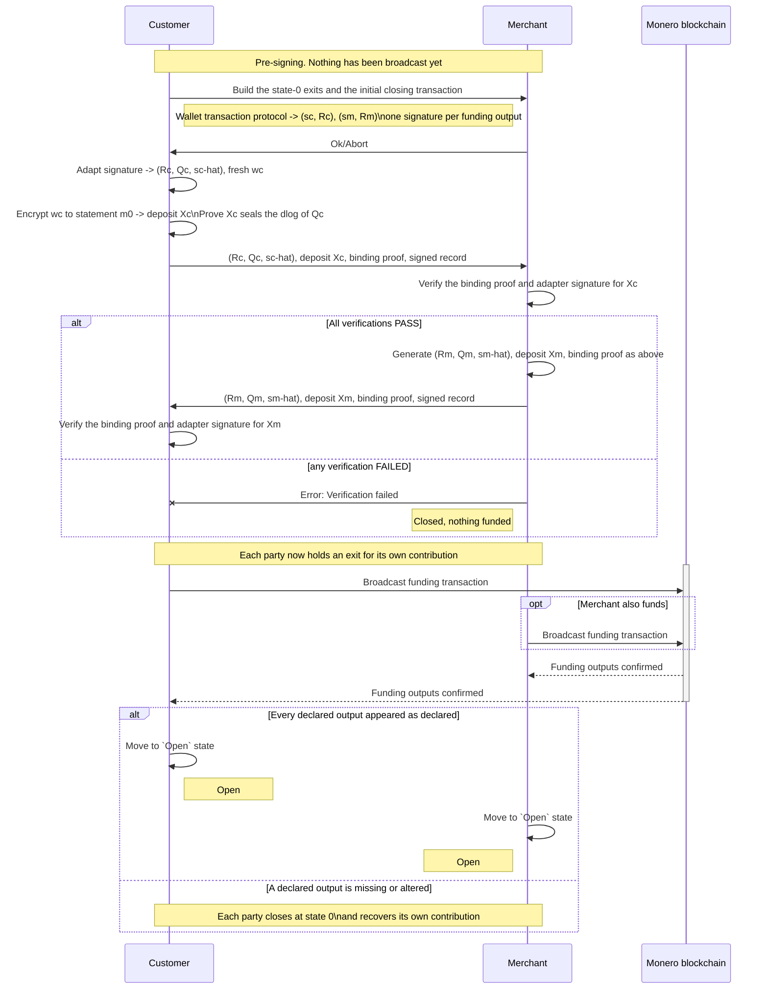

```mermaid
sequenceDiagram
    participant C as Customer
    participant M as Merchant
    participant L1 as Monero blockchain

    note over C,M: Pre-signing. Nothing has been broadcast yet

    C->>M: Build the state-0 exits and the initial closing transaction
    note right of C: Wallet transaction protocol -> (sc, Rc), (sm, Rm)\none signature per funding output
    M->>C: Ok/Abort

    C->>C: Adapt signature -> (Rc, Qc, sc-hat), fresh wc
    C->>C: Encrypt wc to statement m0 -> deposit Xc\nProve Xc seals the dlog of Qc
    C->>M: (Rc, Qc, sc-hat), deposit Xc, binding proof, signed record
    M->>M: Verify the binding proof and adapter signature for Xc

    alt All verifications PASS
        M->>M: Generate (Rm, Qm, sm-hat), deposit Xm, binding proof as above
        M->>C: (Rm, Qm, sm-hat), deposit Xm, binding proof, signed record
        C->>C: Verify the binding proof and adapter signature for Xm
    else any verification FAILED
        M-xC: Error: Verification failed
        note left of M: Closed, nothing funded
    end

    note over C,M: Each party now holds an exit for its own contribution

    activate L1
    C->>L1: Broadcast funding transaction
    opt Merchant also funds
        M->>L1: Broadcast funding transaction
    end
    L1-->>M: Funding outputs confirmed
    L1-->>C: Funding outputs confirmed
    deactivate L1

    alt Every declared output appeared as declared
        C->>C: Move to `Open` state
        note right of C: Open
        M->>M: Move to `Open` state
        note left of M: Open
    else A declared output is missing or altered
        note over C,M: Each party closes at state 0\nand recovers its own contribution
    end
```
