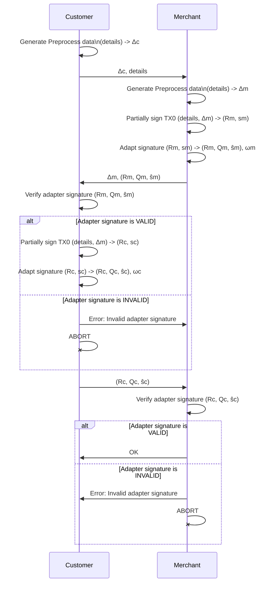

```mermaid
sequenceDiagram
    participant C as Customer
    participant M as Merchant

    C->>C: Generate Preprocess data\n(details) -> Δc
    C->>M: Δc, details

    M->>M: Generate Preprocess data\n(details) -> Δm
    M->>M: Partially sign TX0 (details, Δm) -> (Rm, sm)
    M->>M: Adapt signature (Rm, sm) -> (Rm, Qm, ŝm), ωm
    M->>C: Δm, (Rm, Qm, ŝm)

    C->>C: Verify adapter signature (Rm, Qm, ŝm)
    alt Adapter signature is VALID
        C->>C: Partially sign TX0 (details, Δm) -> (Rc, sc)
        C->>C: Adapt signature (Rc, sc) -> (Rc, Qc, ŝc), ωc
    else Adapter signature is INVALID
        C->>M: Error: Invalid adapter signature
        C-xC: ABORT
    end
    
    C->>M: (Rc, Qc, ŝc)
    M->>M: Verify adapter signature (Rc, Qc, ŝc)
    alt Adapter signature is VALID
        M->>C: OK
    else Adapter signature is INVALID
        M->>C: Error: Invalid adapter signature
        M-xM: ABORT
    end
```