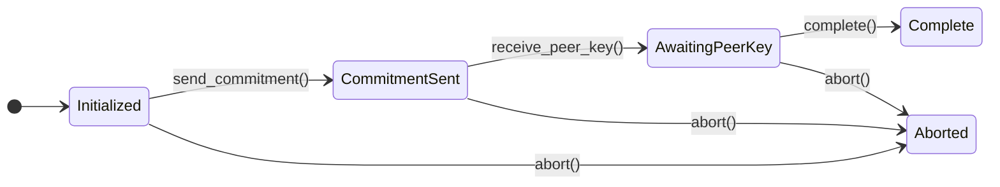
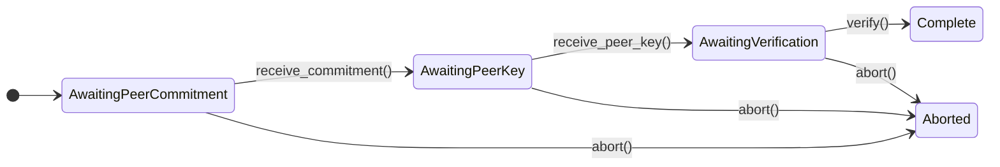
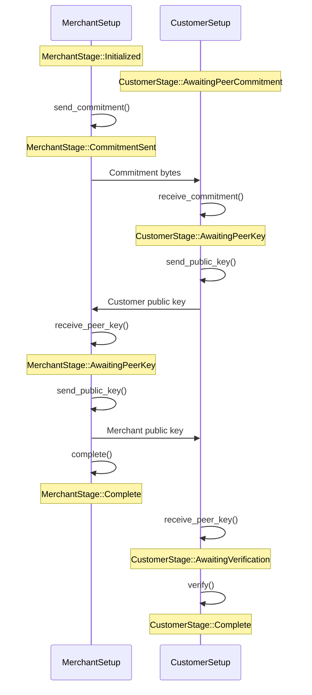

# MultisigWalletSetup State Transition Diagram

This document describes the state machine for setting up a 2-of-2 multisig wallet between Customer and Merchant parties using a commit-reveal protocol.

## Design Overview

The implementation uses **role-specific types** (`MerchantSetup` and `CustomerSetup`) to leverage Rust's type system for compile-time safety:

- **Minimal runtime checking** - Role validation at construction, type safety thereafter
- **Role-specific stage enums** - Each role only has its valid states

## Protocol Overview

The protocol ensures neither party can manipulate their public key based on knowledge of the other party's key:

1. **Merchant** commits to their public key (hash) and sends it to Customer
2. **Customer** receives the commitment, then sends their public key
3. **Merchant** receives Customer's key, then reveals their public key
4. **Customer** verifies Merchant's public key matches the original commitment

## Type-Safe API

```rust
// Preferred: Use role-specific types for compile-time safety
let mut merchant = MerchantSetup::new(wallet)?;  // Returns Err if wallet is not Merchant
let mut customer = CustomerSetup::new(wallet)?;  // Returns Err if wallet is not Customer

// Methods are role-specific - no way to call wrong method
merchant.send_commitment()?;     // Only exists on MerchantSetup
customer.receive_commitment()?;  // Only exists on CustomerSetup
```

## State Diagrams

### Merchant Flow (`MerchantSetup<W>`)



### Customer Flow (`CustomerSetup<W>`)



## Message Flow



## Stage Enums

### MerchantStage

| Stage | Description |
|-------|-------------|
| `Initialized` | Keys generated, ready to send commitment |
| `CommitmentSent` | Commitment sent, waiting for customer's key |
| `AwaitingPeerKey` | Received customer's key, ready to send ours |
| `Complete` | Setup successful |
| `Aborted` | Setup failed |

### CustomerStage

| Stage | Description |
|-------|-------------|
| `AwaitingPeerCommitment` | Waiting for merchant's commitment |
| `AwaitingPeerKey` | Commitment received, ready to exchange keys |
| `AwaitingVerification` | Have merchant's key, ready to verify |
| `Complete` | Setup successful |
| `Aborted` | Setup failed |

## API Reference

### Common Trait: `SetupState<W>`

Both `MerchantSetup` and `CustomerSetup` implement this trait:

```rust
pub trait SetupState<W>: HasPublicKey {
    type Stage: Display + Copy;

    fn is_ready(&self) -> bool;
    fn stage(&self) -> Self::Stage;
    fn has_aborted(&self) -> bool;
    fn abort_reason(&self) -> Option<&MultisigSetupError>;
    fn abort(&mut self, reason: MultisigSetupError);
    fn wallet(&self) -> &W;
    fn finalize(self) -> Result<W, (Self, MultisigSetupError)>;
}
// Note: public_key() -> Curve25519PublicKey is provided via HasPublicKey supertrait
```

### MerchantSetup Methods

```rust
impl MerchantSetup<W> {
    pub fn new(wallet: W) -> Result<Self, MultisigSetupError>;
    pub fn send_commitment(&mut self) -> Result<Vec<u8>, MultisigSetupError>;
    pub fn receive_peer_key(&mut self, data: &[u8]) -> Result<(), MultisigSetupError>;
    pub fn send_public_key(&self) -> Result<Vec<u8>, MultisigSetupError>;
    pub fn complete(&mut self) -> Result<(), MultisigSetupError>;
}
```

### CustomerSetup Methods

```rust
impl CustomerSetup<W> {
    pub fn new(wallet: W) -> Result<Self, MultisigSetupError>;
    pub fn receive_commitment(&mut self, data: &[u8]) -> Result<(), MultisigSetupError>;
    pub fn send_public_key(&self) -> Result<Vec<u8>, MultisigSetupError>;
    pub fn receive_peer_key(&mut self, data: &[u8]) -> Result<(), MultisigSetupError>;
    pub fn verify(&mut self) -> Result<(), MultisigSetupError>;
}
```

## Error Handling

```rust
pub enum MultisigSetupError {
    InvalidStateTransition { state: String, action: &'static str },
    CommitmentMismatch,
    SerializationError(String),
    DeserializationError(String),
    Timeout,
    MissingData(String),
    WrongRole,
}
```

