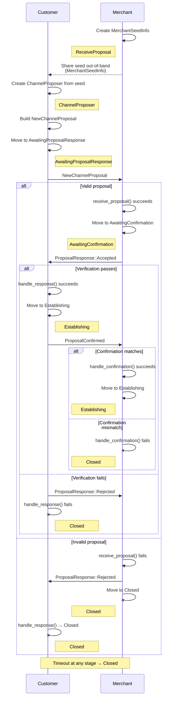

```mermaid
sequenceDiagram
participant Customer
participant Merchant

Merchant->>Merchant: Create MerchantSeedInfo
note left of Merchant: ReceiveProposal
Merchant-->>Customer: Share seed out-of-band<br/>{MerchantSeedInfo}

Customer->>Customer: Create ChannelProposer from seed
note right of Customer: ChannelProposer
Customer->>Customer: Build NewChannelProposal
Customer->>Customer: Move to AwaitingProposalResponse
note right of Customer: AwaitingProposalResponse
Customer->>Merchant: NewChannelProposal

alt Valid proposal
    Merchant->>Merchant: receive_proposal() succeeds
    Merchant->>Merchant: Move to AwaitingConfirmation
    note left of Merchant: AwaitingConfirmation
    Merchant->>Customer: ProposalResponse::Accepted

    alt Verification passes
        Customer->>Customer: handle_response() succeeds
        Customer->>Customer: Move to Establishing
        note right of Customer: Establishing
        Customer->>Merchant: ProposalConfirmed

        alt Confirmation matches
            Merchant->>Merchant: handle_confirmation() succeeds
            Merchant->>Merchant: Move to Establishing
            note left of Merchant: Establishing
        else Confirmation mismatch
            Merchant-xMerchant: handle_confirmation() fails
            note left of Merchant: Closed
        end

    else Verification fails
        Customer->>Merchant: ProposalResponse::Rejected
        Customer-xCustomer: handle_response() fails
        note right of Customer: Closed
    end

else Invalid proposal
    Merchant->>Merchant: receive_proposal() fails
    Merchant->>Customer: ProposalResponse::Rejected
    Merchant-xMerchant: Move to Closed
    note left of Merchant: Closed
    Customer-xCustomer: handle_response() → Closed
    note right of Customer: Closed
end

note over Customer,Merchant: Timeout at any stage → Closed
```
