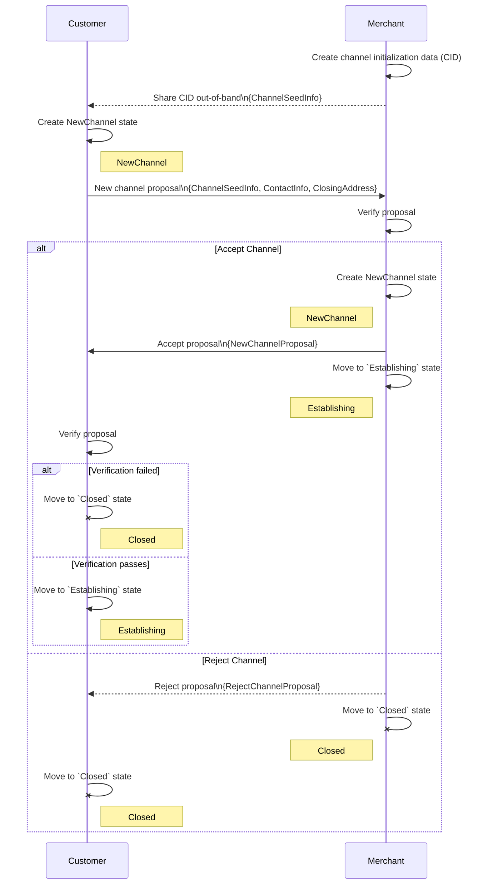

```mermaid
sequenceDiagram
participant Customer
participant Merchant

Merchant->>Merchant: Create channel initialization data (CID)
Merchant-->>Customer: Share CID out-of-band\n{ChannelSeedInfo}
Customer->>Customer: Create NewChannel state
note right of Customer: NewChannel
Customer->>Merchant: New channel proposal\n{ChannelSeedInfo, ContactInfo, ClosingAddress}
Merchant->>Merchant: Verify proposal
alt Accept Channel
    Merchant->>Merchant: Create NewChannel state
    note left of Merchant: NewChannel
    Merchant->>Customer: Accept proposal\n{NewChannelProposal}
    Merchant->>Merchant: Move to `Establishing` state
    note left of Merchant: Establishing
    Customer->>Customer: Verify proposal
    alt Verification failed
        Customer-xCustomer: Move to `Closed` state
        note right of Customer: Closed
    else Verification passes
        Customer->>Customer: Move to `Establishing` state
        note right of Customer: Establishing
    end
else Reject Channel
    Merchant-->>Customer: Reject proposal\n{RejectChannelProposal}
    Merchant-xMerchant: Move to `Closed` state
    note left of Merchant: Closed
    Customer-xCustomer: Move to `Closed` state
    note right of Customer: Closed
end
```
