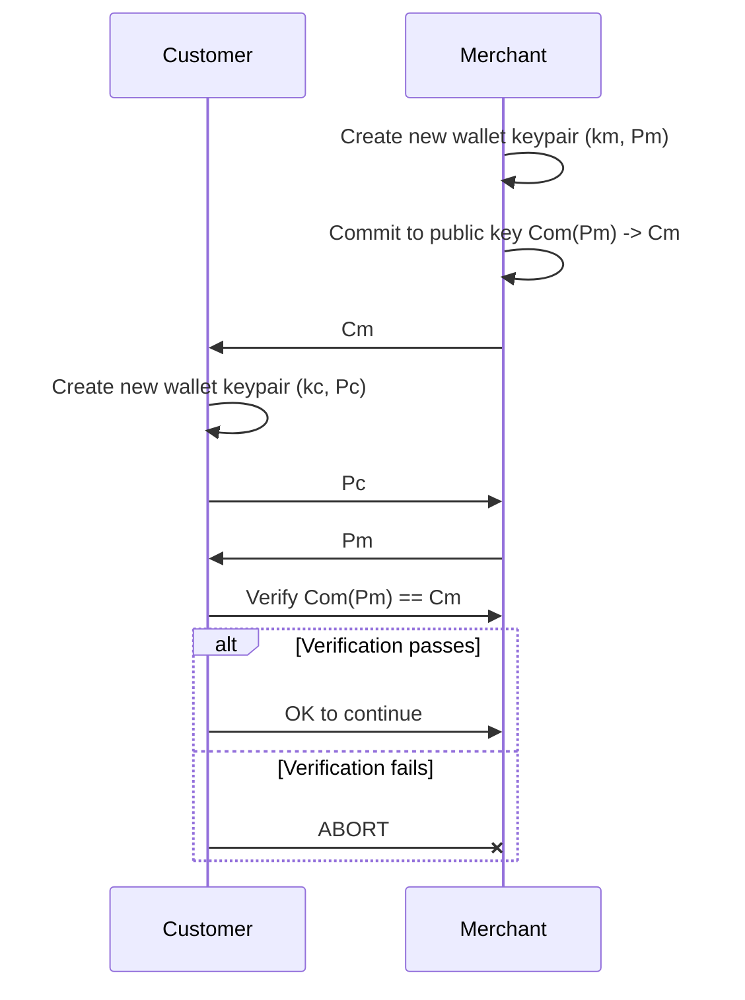

```mermaid
sequenceDiagram
    participant C as Customer
    participant M as Merchant

M->>M: Create new wallet keypair (km, Pm)
M->>M: Commit to public key Com(Pm) -> Cm
M->>C: Cm

C->>C: Create new wallet keypair (kc, Pc)
C->>M: Pc

M->>C: Pm
C->>M: Verify Com(Pm) == Cm
alt Verification passes
    C->>M: OK to continue
else Verification fails
    C-xM: ABORT
end
```